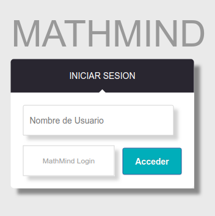
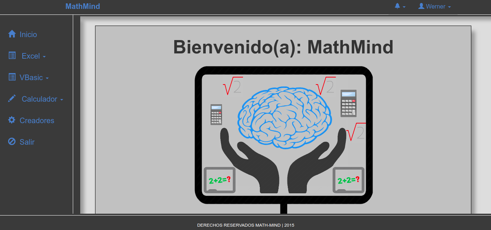
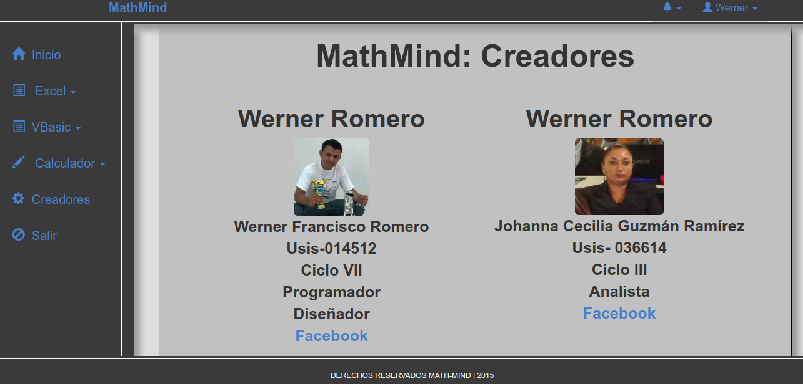

# MathMind
==================

Math Mind, Sistema de Aprendisaje de Matematica Computacional III, UGB

Sirve como repaso a alumnos, que estan cursando la materia

Cuenta con pequeñas calculadoras, para poder desarrollar pequeños ejercicios

cuenta con herramienda de google que permite, crear graficos, en algunas pantallas

# Imagenes del Proyecto

## Inicio de Sesion

## Despues de Iniciar

## Desarrolladores

